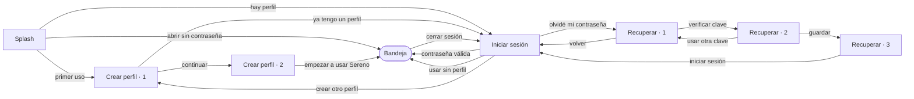

# Sereno · Módulo de acceso

Sereno es un asistente de escritorio para Windows que avisa cuándo tomar una micropausa sin interrumpir la tarea en curso. Este repositorio contiene el **módulo de acceso**: la pantalla de carga, el inicio de sesión, la creación de perfiles y la recuperación de la contraseña.

Proyecto integrador de **Programación Genérica y Eventos** · Universidad Blas Pascal · Ingeniería en Informática.

## Por qué hay perfiles

La definición original de Sereno no contemplaba cuentas de usuario. Durante el desarrollo apareció una limitación: la aplicación no podía distinguir a las personas que comparten una misma computadora. Por eso se incorporó un **perfil local y opcional**:

- No usa email, servidor ni conexión a internet.
- Cada persona tiene su propia carpeta de datos.
- La contraseña se recupera con una **clave de recuperación** que se genera al crear el perfil y se guarda como archivo `.txt` en la carpeta del usuario.
- Quien no quiera contraseña puede usar Sereno sin perfil o marcar "Abrir sin pedir contraseña".

## Pantallas

| Pantalla | Qué hace |
|---|---|
| Splash | Carga los perfiles en segundo plano (menos de 2 s) y decide qué mostrar. |
| Iniciar sesión | Abre el perfil con su contraseña. Permite cambiar de perfil, recuperar el acceso, crear otro perfil o usar Sereno sin perfil. |
| Crear perfil | Paso 1: nombre y contraseña, con medidor de fuerza. Paso 2: clave de recuperación, con botones para copiarla o guardarla como `.txt`. |
| Recuperar acceso | Paso 1: verificar la clave. Paso 2: nueva contraseña. Paso 3: confirmación. |
| Bandeja del sistema | Con la sesión iniciada, Sereno queda en la bandeja. Clic derecho: perfil actual, cerrar sesión y salir. |

## Prototipo navegable

El prototipo visual que se usó para diseñar estas pantallas está en [`docs/prototipo-acceso.html`](docs/prototipo-acceso.html). Se abre con cualquier navegador; la contraseña de prueba es `sereno123`.

## Requisitos

- Windows 10 u 11
- [.NET 8 SDK](https://dotnet.microsoft.com/download/dotnet/8.0)
- Visual Studio 2022 (17.8 o posterior) con la carga de trabajo **Desarrollo de escritorio de .NET**, o solo la CLI de .NET

## Compilar y ejecutar

**Con Visual Studio:** abrir `Sereno.sln` y presionar F5.

**Con la terminal:**

```bash
git clone https://github.com/RRDev48/UBP_PGE.Sereno.git
cd UBP_PGE.Sereno
dotnet run --project src/Sereno
```

**Generar un ejecutable:**

```bash
dotnet publish src/Sereno -c Release -r win-x64 --self-contained false -o publish
```

Solo se puede ejecutar una instancia a la vez. Si Sereno ya está abierto, un segundo inicio muestra un aviso y se cierra.

## Estructura

```
Sereno.sln
src/Sereno/
├── App.xaml(.cs)            Punto de entrada y coordinador de la navegación
├── Vistas/
│   ├── SplashWindow         Pantalla de carga
│   ├── LoginWindow          Iniciar sesión
│   ├── RegistroWindow       Crear perfil (2 pasos)
│   └── RecuperarWindow      Recuperar acceso (3 pasos)
├── Controles/
│   ├── CampoContrasena      PasswordBox + botón mostrar + ayuda + error
│   ├── CampoTexto           TextBox con el mismo formato
│   ├── IndicadorPasos       Pasos con número, texto y estado
│   ├── Marca                Luna + "Sereno"
│   └── AvisoPrivacidad      Candado + texto al pie
├── Servicios/
│   ├── AlmacenPerfiles      Lectura y escritura de perfiles en disco
│   ├── Hasher               PBKDF2-SHA256 para contraseña y clave
│   ├── ClaveRecuperacion    Generación y formato de la clave
│   ├── ReglasContrasena     Longitud mínima, repetición y fuerza
│   ├── BandejaService       Ícono en la bandeja del sistema
│   ├── TemaService          Tema claro u oscuro según Windows
│   ├── Accesibilidad        Anuncios para lectores de pantalla
│   └── Rutas                Carpeta base de datos
├── Modelos/                 Perfil, Configuracion, PerfilEventArgs
├── Temas/                   Claro.xaml, Oscuro.xaml, Estilos.xaml
└── Recursos/sereno.ico
```

## Flujo entre pantallas



## Programación por eventos

Las ventanas no se conocen entre sí. Cada una dispara eventos y `App` decide qué mostrar a continuación.

| Evento | Lo dispara | Qué hace `App` |
|---|---|---|
| `CargaCompleta` | `SplashWindow` | Decide entre crear perfil, iniciar sesión o ir a la bandeja. |
| `SesionIniciada` | `LoginWindow` | Recuerda el perfil y pasa a la bandeja. |
| `RecuperacionSolicitada` | `LoginWindow` | Abre la recuperación para ese perfil. |
| `CreacionSolicitada` | `LoginWindow` | Abre el registro. |
| `UsoSinPerfilSolicitado` | `LoginWindow`, `RegistroWindow` | Entra con el perfil compartido. |
| `RegistroCompletado` | `RegistroWindow` | Pasa a la bandeja con el perfil nuevo. |
| `VolverSolicitado` | `RegistroWindow`, `RecuperarWindow` | Vuelve al inicio de sesión. |
| `CierreDeSesionSolicitado` | `BandejaService` | Oculta la bandeja y muestra el inicio de sesión. |
| `SalidaSolicitada` | `BandejaService` | Cierra la aplicación. |

Los controles también exponen eventos propios (`ContrasenaCambiada`, `TextoCambiado`), que las ventanas usan para limpiar errores y actualizar el medidor de fuerza mientras la persona escribe. Las operaciones lentas, como la verificación de contraseñas, se ejecutan con `async`/`await` para que la interfaz no se congele.

## Dónde se guardan los datos

Todo queda dentro de la carpeta del usuario de Windows:

```
%APPDATA%\Sereno\
├── config.json                  Último perfil que inició sesión
└── Perfiles\
    ├── lucia-3f9a1c\
    │   ├── perfil.json          Datos del perfil (sin contraseñas en texto plano)
    │   └── clave-recuperacion.txt
    └── _compartido\
        └── perfil.json          Perfil de "Usar Sereno sin perfil"
```

Ejemplo de `perfil.json`:

```json
{
  "Id": "3f9a1c0b7e2d4c55a1f0e9b8c7d6a5f4",
  "Nombre": "Lucía",
  "EsCompartido": false,
  "HashContrasena": "q8m1…",
  "SalContrasena": "Zt4r…",
  "HashClave": "c0Pk…",
  "SalClave": "Yh2w…",
  "Iteraciones": 210000,
  "AbrirSinContrasena": false,
  "CreadoEn": "2026-09-15T10:32:00"
}
```

El archivo `clave-recuperacion.txt` se crea al presionar **Guardar como archivo** en el paso 2 del registro. Contiene el nombre del perfil, la fecha y la clave con formato `XXXX-XXXX-XXXX-XXXX`.

Para empezar de cero, cerrá Sereno y borrá la carpeta `%APPDATA%\Sereno`.

## Seguridad

- La contraseña y la clave de recuperación se guardan como **hash PBKDF2-SHA256** con 210.000 iteraciones y una sal aleatoria de 16 bytes por secreto.
- La verificación usa comparación en tiempo constante (`CryptographicOperations.FixedTimeEquals`).
- La clave se genera con `RandomNumberGenerator` y usa un alfabeto sin `0`, `O`, `1` ni `I` para evitar confusiones al copiarla.
- Los archivos se escriben primero en un temporal y después se reemplazan, para no dejar datos a medio guardar.

**Limitación conocida:** el archivo `clave-recuperacion.txt` queda en la misma carpeta que el perfil. Cualquier persona con acceso a esa carpeta de Windows puede leer la clave y cambiar la contraseña. El perfil separa historiales entre personas de confianza que comparten un equipo; no reemplaza a la cuenta de Windows como medida de seguridad.

## Accesibilidad

| Criterio | Cómo se aplica |
|---|---|
| Contraste | Texto de al menos 4.5:1 en tema claro y oscuro. |
| Tamaño de los controles | Botones, casillas y el botón para mostrar la contraseña miden al menos 44 × 44 px. |
| Color | Los errores combinan ícono, texto y borde. El medidor de fuerza dice "débil", "aceptable" o "fuerte". |
| Teclado | Todo se opera con Tab, Enter y la barra espaciadora. El foco siempre es visible. |
| Lectores de pantalla | Nombres accesibles en todos los campos. Los errores y los cambios de estado se anuncian con regiones *live*. |
| Movimiento | Si Windows tiene las animaciones desactivadas o el contraste alto activo, el splash no se anima. |
| Tema | Sigue la configuración clara u oscura de Windows. |

## Estado

**Incluido en esta versión**

- Las cuatro pantallas de acceso y la bandeja del sistema.
- Varios perfiles por computadora, con selección desde el inicio de sesión.
- Perfil compartido para usar Sereno sin contraseña.

**Pendiente**

- Conectar el temporizador de pausas y el historial al perfil que inició sesión (punto marcado en `App.Entrar`).
- Soporte para contraste alto con los colores del sistema.
- Eliminar o renombrar perfiles desde la interfaz.

Si alguien cierra la ventana en el paso 2 del registro, el perfil ya quedó creado y puede entrar con su contraseña, pero la clave no se vuelve a mostrar. Si no la copió ni la guardó, no va a poder recuperar el acceso si olvida la contraseña.

## Autor

Rodríguez, Rodrigo Emmanuel · Profesora: Julia Bulacio
